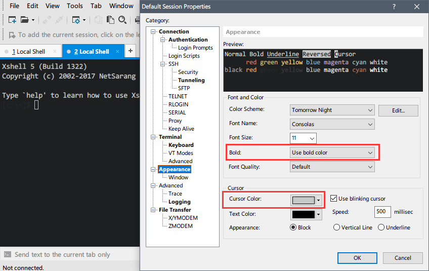

base16-xshell
=============

[base16](https://github.com/chriskempson/base16) for [Xshell](https://www.netsarang.com/products/xsh_overview.html) by Netsarang, Inc.

**NOTE:** All presets in this repository are generated by a base16-builder

Usage
-----

Download the repo, open Xshell and import your favorite scheme from `Tools` -> `Color Schemes` -> `Import`.

**NOTE:** To display correct colors, make sure to select "Use bold color" in `Apperance` -> `Font and Color` -> `Bold` in your Session Properties. Besides, you can change the cursor color in `Apperance` -> `Cursor` -> `Cursor Color`.

License
-------

[MIT](LICENSE) © Chawye Hsu

> [Website](https://chawyehsu.com) · GitHub [@chawyehsu](https://github.com/chawyehsu) · Twitter [@chawyehsu](https://twitter.com/chawyehsu)
